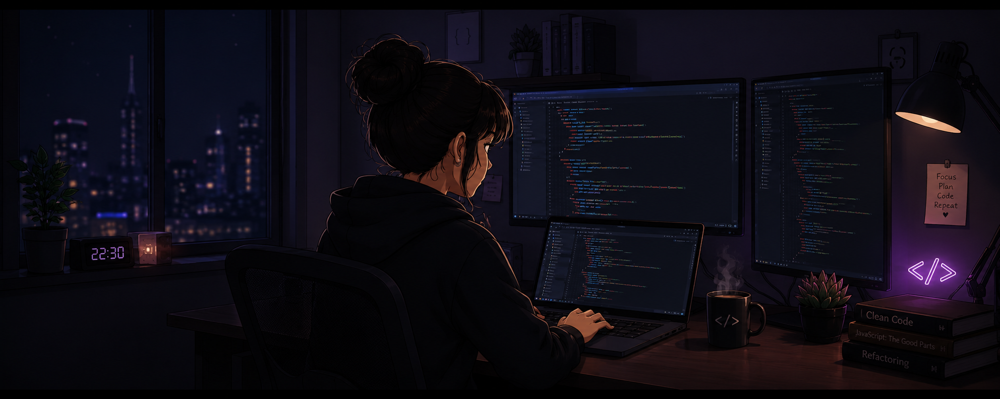

  

# Hi there, I'm Elahe👋

### 🎓 Computer Engineering Student

### 💻 Aspiring Front-End Developer

I'm passionate about building clean and user-friendly web experiences.

Currently learning and growing my skills in front-end development while building projects and exploring new technologies.

---

## 🌷 About Me

* 🎓 Computer Engineering Student
* 🌱 Currently learning JavaScriptو React and Git/GitHub
* 💻 Interested in Front-End Development
* 🚀 Working on improving my coding skills through real projects
* 🎯 Goal: Become a skilled Front-End Developer and contribute to meaningful products

---

## 🛠️ Tech Stack

* HTML
* CSS
* JavaScript
* Git
* GitHub

---

## 🚀 Current Focus

* Building responsive websites
* Writing cleaner JavaScript code
* Learning React
* Expanding my GitHub portfolio

---

## 📫 Connect With Me

💼 LinkedIn:
https://www.linkedin.com/in/elahe-aghalar-474585339

📧 Email:
[elaheh.imh@gmail.com](mailto:elaheh.imh@gmail.com)

---

## ✨ A Little About Me

I enjoy turning ideas into beautiful and functional web pages. Every project teaches me something new, and that's what makes coding exciting for me.
